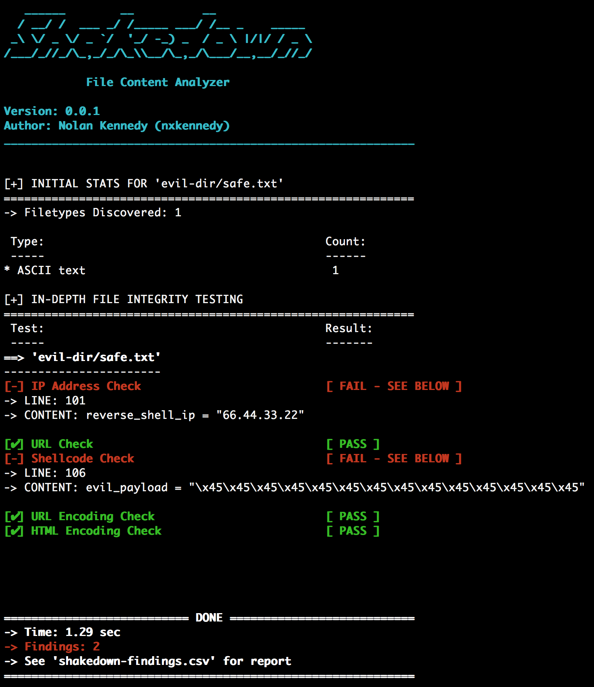

# shakedown
<table>
    <tr>
        <th>Version</th>
        <td>1.0.0</td>
    </tr>
    <tr>
       <th>Author</th>
       <td>Nolan Kennedy (nxkennedy)</td>
    </tr>
    <tr>
        <th>Github</th>
        <td><a href="http://github.com/nxkennedy">http://github.com/nxkennedy</a></td>
    </tr>
</table>

### Description
Shakedown scans uncompiled code for potentially malicious content. Greatly assists vetting complex security tools/frameworks before running them on a company network. (Talking to you, red teams and security engineers)

Shakedown currently checks for:
* IP Addresses
* URLs
* Shellcode
* URL Encoding
* HTML Encoding

### Use Case
Vetting newly downloaded scripts prior to usage in a production environment

### Requirements
* python 3.6
* python-magic (python wrapper for libmagic)

    `sudo apt-get install python-magic`

### Usage
* git clone https://github.com/nxkennedy/shakedown.git

    `python shakedown.py <directory_or_file>`

### Output
Findings are displayed in the terminal as well as stored in a csv report titled "shakedown-findings.csv"

### License
shakedown is distributed under the MIT license.  See the included
LICENSE file for details.
